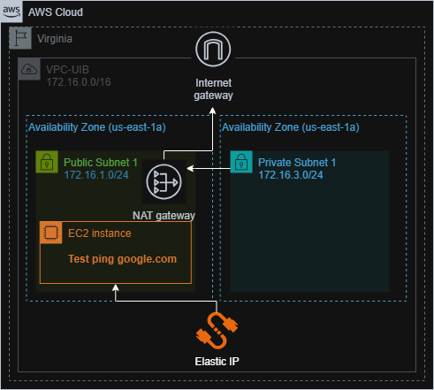

-----

# Infrastruktur Jaringan **AWS VPC**
---

---
### Project ini mendokumentasikan langkah-langkah membangun **arsitektur VPC** dengan pemisahan subnet di **AWS Academy**, dengan fokus pengujian konektivitas pada server di jalur publik.

-----

## I. Persiapan Infrastruktur VPC

### A. Konfigurasi Network (Langkah Manual)

1.  **Membuat VPC**:
      * Masuk ke VPC Dashboard \> **Create VPC**.
      * Pilih **VPC only**.
      * **Name tag**: `CK-VPC`.
      * **IPv4 CIDR**: `172.16.0.0/16`.
2.  **Membuat Subnetting**:
      * Klik **Subnets** \> **Create subnet** \> Pilih `CK-VPC`.
      * **CK-Public-Subnet-1**: AZ `us-east-1a`, CIDR `172.16.1.0/24`.
      * **CK-Private-Subnet-1**: AZ `us-east-1a`, CIDR `172.16.3.0/24`.
3.  **Membuat Gateways**:
      * **CK-IGateway**: Create Internet Gateway \> Attach ke `CK-VPC`.
      * **CK-NAT-Gateway**:
          * Create NAT Gateway di dalam `CK-Public-Subnet`.
          * Connectivity type: **Public**.
          * Klik **Allocate Elastic IP** sebelum menyimpan.

### B. Konfigurasi Routing

1.  **CK-RTB-Public**:
      * Create Route Table \> Name: `CK-RTB-Public`.
      * **Routes**: Edit routes \> Add route `0.0.0.0/0` target **Internet Gateway** (`CK-IGateway`).
      * **Subnet Association**: Kaitkan ke `CK-Public-Subnet-1`.
2.  **CK-RTB-Private**:
      * Create Route Table \> Name: `CK-RTB-Private`.
      * **Routes**: Edit routes \> Add route `0.0.0.0/0` target **NAT Gateway** (`CK-NAT-Gateway`).
      * **Subnet Association**: Kaitkan ke `CK-Private-Subnet`.

-----

## II. Deployment & Testing (Public Server)

### A. Konfigurasi Instance

1.  **Launch Instance**:
      * **Nama**: `CK-Server`.
      * **AMI**: Amazon Linux 2023.
      * **Network**: Pilih `CK-VPC` dan `CK-Public-Subnet`.
      * **Auto-assign Public IP**: **Enable**.
2.  **Security Group**:
      * Buat SG baru: `CK-SG-Testing`.
      * **Inbound Rules**:
          * Type: `SSH` | Port: `22` | Source: `0.0.0.0/0`.
          * Type: `All ICMP - IPv4` | Port: `All` | Source: `0.0.0.0/0`.

### B. Langkah Pengujian Koneksi

Hubungkan ke instance melalui SSH, kemudian jalankan perintah berikut untuk memastikan routing ke internet berjalan:

```bash
# 1. Update sistem untuk verifikasi koneksi HTTP/S
sudo yum update

# 2. Test ping ke internet (Google) untuk verifikasi jalur ICMP
ping google.com
```

-----

## III. Final Challenge: Expansion Lab

Tunjukkan keahlianmu dalam manajemen jaringan AWS dengan menyelesaikan tugas perluasan arsitektur berikut:

### **Instruksi Challenge:**

Tambahkan 2 subnet baru dengan ketentuan CIDR dan AZ yang spesifik agar tidak bentrok dengan infrastruktur eksisting:

| Subnet Name | CIDR Block | Availability Zone | Route Table Target |
| :--- | :--- | :--- | :--- |
| **CK-Public-Subnet-2** | `172.16.2.0/24` | `us-east-1b` | **CK-RTB-Public** |
| **CK-Private-Subnet-2** | `172.16.4.0/24` | `us-east-1b` | **CK-RTB-Private** |

### **Kriteria Keberhasilan:**

1.  Subnet baru terdaftar di VPC yang benar.
2.  Routing telah dikonfigurasi (Public ke IGW, Private ke NAT-GW).
3.  **Hasil Visual**: Tampilkan **VPC Resource Map** yang menunjukkan garis koneksi yang runtut dari Subnet hingga Gateway.

-----

## Tips untuk Challenge:

  * **Gunakan Nama yang Konsisten**: Gunakan akhiran `-2` untuk memudahkan identifikasi.
  * **Cek Subnet Association**: Kesalahan paling umum adalah lupa mengasosiasikan subnet baru ke Route Table yang sudah dibuat.
  * **Resource Map**: Pastikan garis dari Subnet Private mengarah ke NAT Gateway, bukan langsung ke Internet Gateway.

-----
